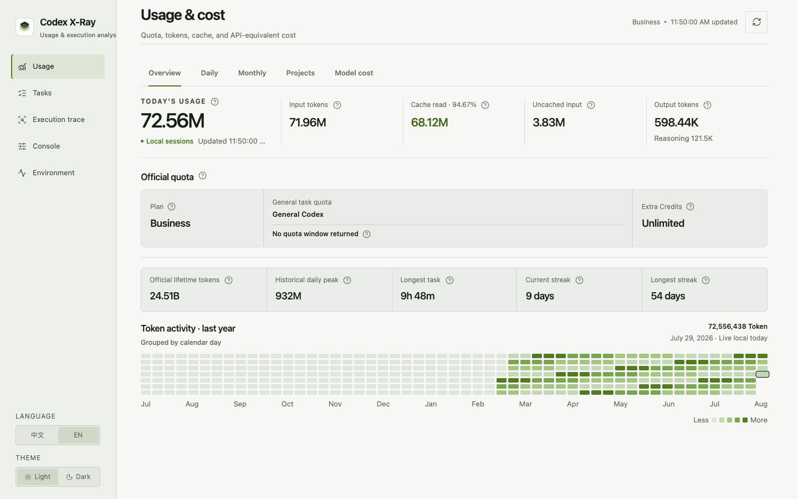
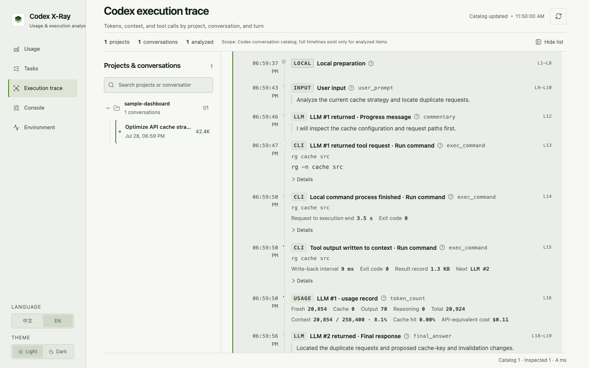

<p align="center">
  
</p>

<h1 align="center">Codex X-Ray</h1>

<p align="center">
  Understand Codex usage, cost, context, and every execution step.
</p>

<p align="center">
  <strong>English</strong> · <a href="README.md">简体中文</a>
</p>

<p align="center">
  <a href="https://github.com/lakernote/codex-xray/actions/workflows/ci.yml"></a>
  <a href="LICENSE"></a>
</p>

Codex X-Ray is a local-first visual companion for Codex. It connects to the installed Codex App Server and inspects local Sessions on demand, turning scattered quota, token, cost, project, turn, LLM, and tool-call data into auditable ledgers and timelines.

> [!IMPORTANT]
> Codex X-Ray is an independent, unofficial open-source project. It is not affiliated with, sponsored by, or endorsed by OpenAI. The project is in an early stage and may need to adapt as Codex interfaces evolve.

## Screenshots

### Usage overview

Official quota and local Session usage remain separate, with input, cache, output, yearly activity, and API-equivalent cost shown together.



### Execution timeline

Follow local preparation, user input, LLM output, tool request, Codex execution, result write-back, token accounting, and turn completion in Session order.



Every screenshot is generated from a fictional project and simulated Session data. No real user path, conversation, account, or key is included.

## Highlights

- **Usage and cost** — inspect today, daily, monthly, model, and project-level input, cache, output, total tokens, and API-equivalent cost.
- **Execution trace** — navigate project → conversation → turn and inspect context, cache, compaction, LLM, CLI, MCP, Skill, browser, automation, and sub-agent events.
- **Task status** — group running, approval-blocked, input-blocked, failed, interrupted, and recently completed Codex tasks while showing the source of each status.
- **Visual console** — understand and preview model behavior, approvals, sandboxing, network access, Memory, compaction, tools, and Provider settings before writing through the official configuration API.
- **Provider switching** — configure OpenAI, Qwen, Doubao, Qianfan-hosted models, MiniMax, StepFun, and custom Responses providers.
- **Environment diagnostics** — inspect the Codex CLI/App Server, key directories, SQLite, Provider, MCP, Skills, and Plugins without reading credential values.
- **Chinese/English and light/dark themes** — persisted locally.

## Data flow

```text
Codex App Server ──account, quota, catalog, configuration──┐
                                                          ├─ local Rust analysis ─ SQLite index ─ React UI
$CODEX_HOME/sessions ──read-only JSONL events─────────────┘
```

- Official values keep their original semantics; local derivations and cost estimates are labeled.
- Original Codex Sessions, databases, and task content remain read-only.
- Conversations are analyzed only after selection; opening the catalog does not parse all history.
- The index lives in Codex X-Ray's own application data directory and is incrementally updated with SQLite WAL.

## Privacy and security

- Codex X-Ray does not read `auth.json`, proxy or intercept Codex traffic, or upload local analysis.
- Execution details can display user messages, assistant messages, and readable summaries from the original Session on demand; message bodies are not written to the SQLite index.
- SQLite stores usage, structured phases, source line references, and bounded/redacted command, argument, and result metadata. It does not store complete tool output, full patches, or files read by Codex.
- Provider profiles store environment-variable names only. During an explicit connection test, the Rust backend reads the selected key transiently; the key is not returned to the webview, logged, or passed through process arguments.
- Configuration changes require a visible diff and explicit confirmation, with a recoverable previous state.

See the [English data source guide](docs/data-sources.en.md) for field sources, formulas, and limitations. See [SECURITY.md](SECURITY.md) for vulnerability reporting.

## Run from source

Signed installers are not published yet. Development requires:

- Node.js 22 (18 minimum)
- Rust stable
- An installed and authenticated Codex

```bash
git clone https://github.com/lakernote/codex-xray.git
cd codex-xray
npm ci
npm run tauri dev
```

Build and verify:

```bash
npm run version:check
npm run check
npm run build
npm run test:rust
npm run tauri build
```

If `codex` is not on `PATH`, Codex X-Ray attempts to detect the CLI bundled with the Codex/ChatGPT app. You can also set `CODEX_BIN` explicitly.

## Current limitations

- API-equivalent cost estimates token value; it is not a ChatGPT/Codex subscription bill or an actual charge.
- A separate App Server cannot always observe every transient state inside another Codex App process. The UI distinguishes official states from local-event inference.
- Codex App Server and Session formats may evolve; compatibility follows the locally installed version.
- The project is currently validated primarily on macOS. CI and draft build configuration cover Windows, Linux, and macOS.

## Documentation

- [English data source guide](docs/data-sources.en.md)
- [中文数据来源与指标口径](docs/data-sources.zh-CN.md)
- [Contributing](CONTRIBUTING.md)
- [Release process](docs/releasing.md)
- [Security policy](SECURITY.md)
- [Changelog](CHANGELOG.md)

## License

[MIT](LICENSE)
