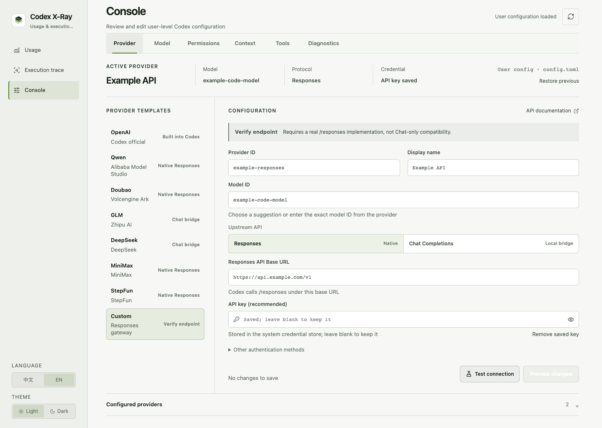
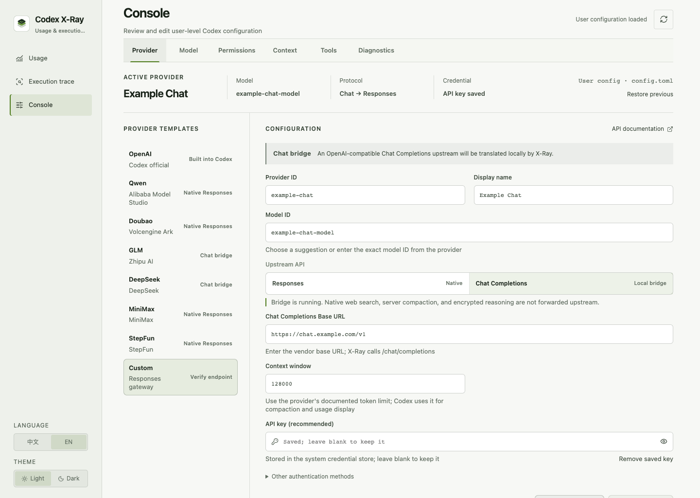

<p align="center">
  
</p>

<h1 align="center">Codex X-Ray</h1>

<p align="center">
  Understand Codex usage, cost, context, and every execution step.
</p>

<p align="center">
  <strong>English</strong> · <a href="README.zh-CN.md">简体中文</a>
</p>

<p align="center">
  <a href="https://github.com/lakernote/codex-xray/actions/workflows/ci.yml"></a>
  <a href="https://github.com/lakernote/codex-xray/releases"></a>
  <a href="LICENSE"></a>
</p>

Codex X-Ray is a usage and execution analysis tool for Codex. It shows quota and tokens, tracks cost by project, conversation, and turn, and reconstructs the execution timeline of LLM and tool calls.

> [!IMPORTANT]
> Codex X-Ray is an unofficial open-source project and is not affiliated with or endorsed by OpenAI.

## Download

Preview installers are available on the [GitHub Releases page](https://github.com/lakernote/codex-xray/releases). Choose the asset by its filename suffix:

| System | Installer |
| --- | --- |
| macOS · Apple Silicon | `_aarch64.dmg` |
| macOS · Intel | `_x64.dmg` |
| Windows · 64-bit | `_x64-setup.exe` |
| Ubuntu / Debian · 64-bit | `_amd64.deb` |
| Fedora / RHEL · 64-bit | `.x86_64.rpm` |

These preview builds are not yet signed with a trusted publisher certificate or notarized, so the first installation may show an unidentified-developer warning. Codex must already be installed and authenticated. The “Source code” archives are source snapshots, not installers.

Updater-enabled stable builds check at most once per day. When a newer stable version is available, you can ignore it or let Codex X-Ray download, verify, install, and restart in place. The current Linux DEB/RPM packages continue to update manually.

## Screenshots

### Usage overview

Official quota and local Session usage remain separate, with input, cache, output, yearly activity, and API-equivalent cost shown together.

[](docs/assets/usage-overview.en.png)

### Model access

Connect native Responses or Chat Completions model services, save multiple profiles, and switch between them. API keys stay in X-Ray's user-only local credential directory.

[](docs/assets/provider-console.en.png)

### Chat compatibility bridge

Connect an OpenAI-compatible Chat Completions endpoint through X-Ray's local bridge while Codex continues to use the Responses protocol.

[](docs/assets/chat-bridge-console.en.png)

### Execution timeline

Follow local preparation, user input, LLM output, tool request, Codex execution, result write-back, token accounting, and turn completion in Session order.

[](docs/assets/execution-trace.en.png)

Every screenshot is generated from a fictional project and simulated Session data. No real user path, conversation, account, or key is included.

## Core features

### Usage and cost

Official quota and reset information, plus local token and API-equivalent cost ledgers by day, month, model, project, conversation, and turn. Model pricing can be customized by effective date.

### Execution trace

Browse Sessions by project, conversation, and turn, then reconstruct each turn from user input through LLM responses, CLI/MCP/Skill calls, tool results, token accounting, and completion. Context analysis shows first, peak, and final model input; recorded compaction boundaries and estimated reduction; local preparation records; and explicit Memory usage evidence without treating compaction as long-term Memory.

The raw-record view lets you verify a Timeline against its source JSONL line by line without analyzing the conversation first. It also exposes X-Ray's own App Server messages and the full Responses → Chat → Responses flow when a request crosses the Chat compatibility bridge. Native provider HTTP traffic goes directly from Codex to that provider and is therefore not presented as captured traffic.

### Providers and Codex configuration

Save multiple provider profiles with separate models, endpoints, protocols, and credentials, then switch among them with one click. Native Responses providers connect directly; OpenAI-compatible Chat providers use the local compatibility bridge. Common Codex settings are also available in the GUI, and every active-provider change keeps a recoverable previous state.

### Desktop tools

Chinese and English interfaces, light and dark themes, signed in-app stable updates, version detection, and shortcuts to Codex configuration, Sessions, Skills, Plugins, and X-Ray's SQLite index.

## How Chat providers connect to Codex

Codex never reads the upstream Chat Completions URL. It reads a normal custom Provider from `~/.codex/config.toml`, whose `base_url` points to X-Ray's local bridge and whose `wire_api` remains `responses`.

[](docs/assets/provider-flow.png)

The API key is stored in X-Ray's user-only credential directory and is never written to `config.toml`. When Codex needs a Bearer token, the Provider's official `auth.command` invokes X-Ray's credential helper.

### One tool-calling turn

[](docs/assets/chat-bridge-flow.png)

The model only chooses a tool and its arguments. Codex performs approval and execution, captures the result, and starts the next model call. The bridge never executes tools; it only translates request fields and streaming events between the two protocols.

The Chat bridge currently translates system and conversation messages, streaming text, function tools, parallel tool calls, and token usage. Codex-native web search, server-side compaction, and encrypted reasoning are not forwarded to the Chat upstream.

## Data flow

```text
Codex App Server ──account, quota, catalog, configuration──┐
                                                          ├─ local Rust analysis ─ SQLite index ─ React UI
$CODEX_HOME/sessions ──read-only JSONL events─────────────┘
```

- Official values keep their original semantics; local derivations and cost estimates are labeled.
- Original Codex Sessions, databases, and task content remain read-only.
- Conversations are analyzed only after selection; opening the catalog does not parse all history.
- The index lives in Codex X-Ray's own application data directory and is incrementally updated with SQLite WAL.

## Privacy and security

- Codex X-Ray does not read `auth.json` or upload local analysis. Native Responses providers connect directly; only a Chat Completions provider explicitly selected in the Console is routed through the local X-Ray bridge.
- Execution details can display user messages, assistant messages, and readable summaries from the original Session on demand; message bodies are not written to the SQLite index.
- SQLite stores usage, structured phases, source line references, and bounded/redacted command, argument, and result metadata. It does not store complete tool output, full patches, or files read by Codex.
- Provider keys are stored in a user-only credential file under `~/.codex/codex-xray/credentials/`. Codex reads them on demand through its official command-backed provider authentication; keys are never written to `config.toml`, SQLite, logs, or process arguments. The local Chat bridge forwards only the selected provider key and ignores unrelated inbound authorization. Environment-variable authentication remains available.
- Configuration changes require a visible diff and explicit confirmation, with a recoverable previous state.

See the [English data source guide](docs/data-sources.en.md) for field sources, formulas, and limitations. See [SECURITY.md](SECURITY.md) for vulnerability reporting.

## Run from source

Development requires:

- Node.js 22 (18 minimum)
- Rust stable
- An installed and authenticated Codex

```bash
git clone https://github.com/lakernote/codex-xray.git
cd codex-xray
npm ci
npm run tauri dev
```

Build and verify:

```bash
npm run version:check
npm run check
npm run build
npm run test:rust
npm run tauri build
```

On macOS, the npm wrapper writes development and local release bundles to `src-tauri/target.noindex`. This keeps build copies out of Spotlight, Finder app search, and Launchpad; the installed copy in `/Applications` remains visible.

If `codex` is not on `PATH`, Codex X-Ray attempts to detect the CLI bundled with the Codex/ChatGPT app. You can also set `CODEX_BIN` explicitly.

## Current limitations

- API-equivalent cost estimates token value; it is not a ChatGPT/Codex subscription bill or an actual charge.
- A separate App Server cannot always observe every transient state inside another Codex App process. The UI distinguishes official states from local-event inference.
- Codex App Server and Session formats may evolve; compatibility follows the locally installed version.
- The Chat bridge translates text, streaming output, function tools, tool results, and token usage. Responses-only features such as native Web Search, encrypted reasoning, and server-side compaction are not translated.
- Chat providers require Codex X-Ray to remain running. Closing Codex X-Ray stops the local compatibility bridge.
- The project is currently validated primarily on macOS. Release builds cover Windows, Linux, and macOS.

## License

[MIT](LICENSE)
