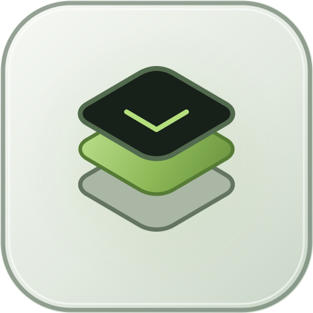
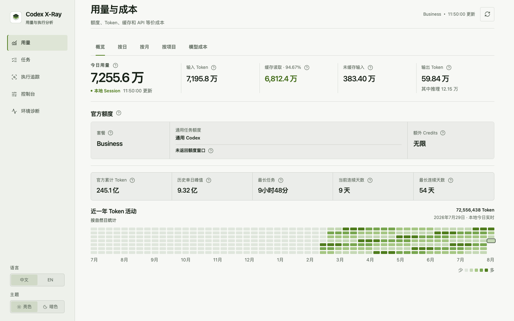
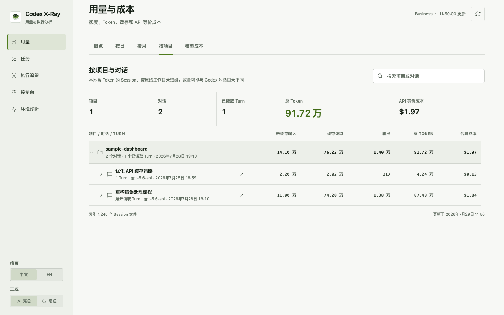
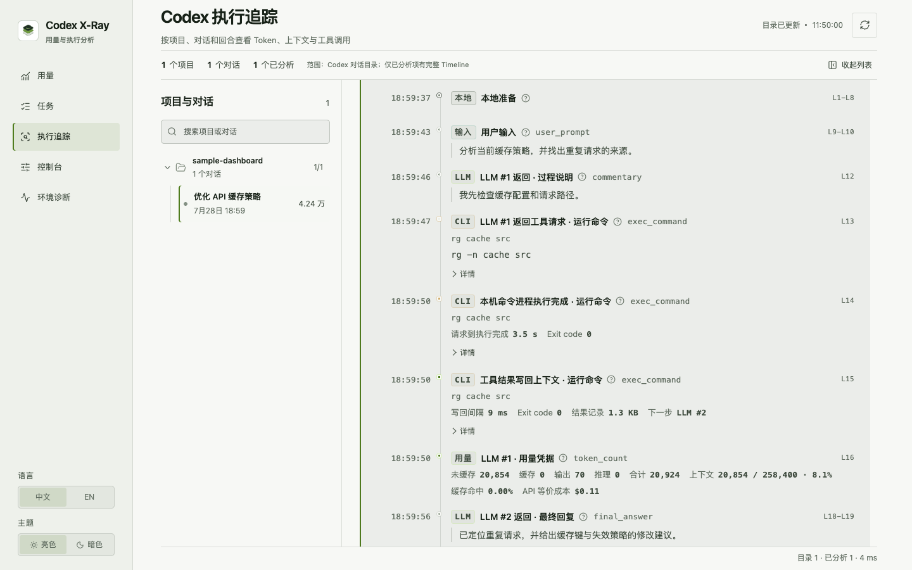

<p align="center">
  
</p>

<h1 align="center">Codex X-Ray</h1>

<p align="center">
  看清 Codex 的用量、成本、上下文与每一步执行。
</p>

<p align="center">
  <a href="README.en.md">English</a> · <strong>简体中文</strong>
</p>

<p align="center">
  <a href="https://github.com/lakernote/codex-xray/actions/workflows/ci.yml"></a>
  <a href="LICENSE"></a>
</p>

Codex X-Ray 是一个本地优先的 Codex 可视化助手。它连接当前安装的 Codex App Server，并按需解析本机 Session，把分散的额度、Token、成本、项目、回合、LLM 与工具调用还原成可以核对的账本和 Timeline。

> [!IMPORTANT]
> Codex X-Ray 是独立的非官方开源项目，与 OpenAI 无隶属、合作或背书关系。目前处于早期版本，数据结构会随 Codex 接口演进。

## 界面

### 用量概览

官方额度与本地 Session 用量分开呈现，同时展示输入、缓存、输出、年度活动和 API 等价成本。



### 项目、对话与回合账本

按原始工作目录组织项目，继续下钻到对话和 Turn，核对 Token 与成本去向。



### 真实执行 Timeline

按 Session 中的顺序解释本地准备、用户输入、LLM 返回、工具请求、Codex 执行、结果写回、Token 结算和回合结束。



以上截图全部由虚构项目和模拟 Session 数据生成，不包含真实用户路径、对话、账号或密钥。

## 主要能力

- **用量与成本**：查看今日、按日、按月、按模型和按项目的输入、缓存、输出、总 Token 与 API 等价成本。
- **执行追踪**：按项目 → 对话 → Turn 展示上下文、缓存、压缩、LLM、CLI、MCP、Skill、浏览器、自动化和子 Agent 事件。
- **任务状态**：汇总运行中、等待审批、等待输入、失败、中断和最近完成的 Codex 任务，并标明状态来源。
- **可视化控制台**：解释并预览模型行为、审批、沙箱、联网、Memory、压缩、工具与 Provider 配置，确认后才通过官方配置接口写入。
- **Provider 切换**：提供 OpenAI、Qwen、豆包、千帆托管模型、MiniMax、StepFun 和自定义 Responses Provider 预设。
- **环境诊断**：检查 Codex CLI/App Server、关键目录、SQLite、Provider、MCP、Skills 和 Plugins，不读取凭据值。
- **中英文与明暗主题**：默认中文亮色，可在应用内切换并保存在本机。

## 数据如何流动

```text
Codex App Server ──账户、额度、对话目录、配置──┐
                                                ├─ Rust 本地分析 ─ SQLite 索引 ─ React 界面
$CODEX_HOME/sessions ──只读 JSONL 事件─────────┘
```

- 官方账户值保持原始口径；本地推导和成本估算会明确标注。
- 原始 Codex Session、数据库和任务内容始终只读。
- 对话只在用户选择后分析；打开目录不会自动解析全部历史。
- 索引存放在 Codex X-Ray 自己的应用数据目录，并使用 SQLite WAL 增量更新。

## 隐私与安全

- 不读取 `auth.json`，不代理或拦截 Codex 请求，也不上传本地分析数据。
- 执行详情会按需从原始 Session 显示用户消息、助手消息和可读摘要；这些正文不写入 SQLite 索引。
- SQLite 只保存用量、结构化阶段、来源行号，以及限长且脱敏的命令、参数和结果元数据；不保存完整工具输出、完整补丁或读取到的文件内容。
- Provider 只保存环境变量名。连接测试时，Rust 后端临时读取对应 Key；Key 不返回前端、不写日志、不进入进程参数。
- 配置修改必须先查看差异并再次确认，同时保留可恢复的上一状态。

更完整的字段来源、计算公式和边界见[中文数据说明](docs/data-sources.zh-CN.md)。安全问题请阅读 [SECURITY.md](SECURITY.md)。

## 从源码运行

当前尚未发布签名安装包。开发环境需要：

- Node.js 22（最低 18）
- Rust stable
- 已安装并登录的 Codex

```bash
git clone https://github.com/lakernote/codex-xray.git
cd codex-xray
npm ci
npm run tauri dev
```

构建与验证：

```bash
npm run version:check
npm run check
npm run build
npm run test:rust
npm run tauri build
```

如果 `codex` 不在 `PATH`，应用会尝试检测 Codex/ChatGPT App 的内置 CLI；也可以通过 `CODEX_BIN` 指定可执行文件。

## 当前边界

- API 等价成本用于比较 Token 价值，不是 ChatGPT/Codex 订阅账单或实际扣款。
- 独立 App Server 无法保证看到另一个 Codex App 进程的全部瞬时状态；界面会区分官方状态与本地事件推断。
- Codex App Server 与 Session 格式仍可能变化，兼容性以当前安装版本为准。
- 当前主要在 macOS 上验证；仓库提供 Windows、Linux 和 macOS 的 CI/草稿构建配置。

## 项目文档

- [数据来源与指标口径](docs/data-sources.zh-CN.md)
- [English data source guide](docs/data-sources.en.md)
- [贡献指南](CONTRIBUTING.md)
- [发布流程](docs/releasing.md)
- [安全策略](SECURITY.md)
- [更新记录](CHANGELOG.md)

## License

[MIT](LICENSE)
