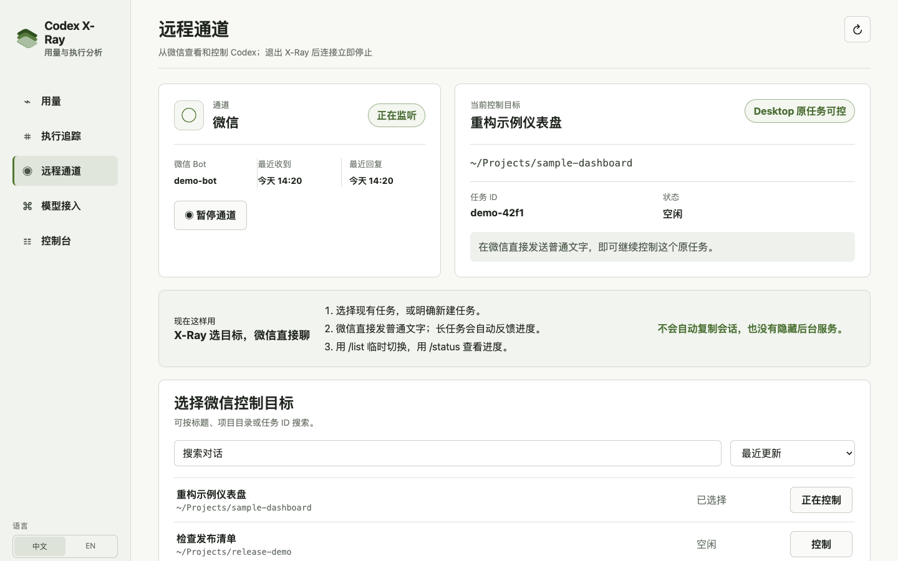
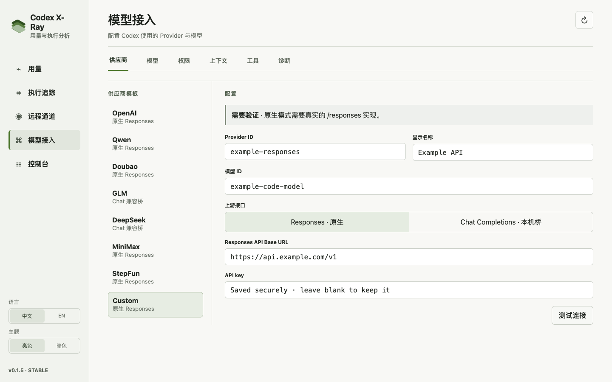

<p align="center">
  
</p>

<h1 align="center">Codex X-Ray</h1>

<p align="center">在本机看清 Codex 的用量、成本、上下文与每一步执行。</p>

<p align="center">
  <a href="README.md">English</a> · <strong>简体中文</strong>
</p>

<p align="center">
  <a href="https://github.com/lakernote/codex-xray/actions/workflows/ci.yml"></a>
  <a href="https://github.com/lakernote/codex-xray/releases"></a>
  <a href="LICENSE"></a>
</p>

Codex X-Ray 是一款本地桌面工作台，用来理解和控制 Codex。它把官方账户数据与本机 Codex Session 的只读分析放在一起。

> [!IMPORTANT]
> Codex X-Ray 是非官方开源项目，与 OpenAI 无隶属或背书关系。

## 功能

### 用量与成本

- 分开展示官方额度、重置时间和本机 Session 用量。
- 按日、月、模型、项目、对话和 Turn 拆解 Token 与 API 等价成本。
- 支持按生效日期配置模型单价，不会修改真实 Provider 计费。

[](docs/assets/usage-overview.zh-CN.png)

### 执行追踪

- 从提示词和模型回复开始，还原 CLI、MCP、Skill、文件、浏览器和子 Agent 的执行过程。
- 查看 Token 结算、上下文增长、缓存使用、压缩边界、工具耗时、失败和重复工作。
- 按需打开原始 Session 记录，逐行核对分析结果。

[](docs/assets/execution-trace.zh-CN.png)

### 微信远程控制

- 扫码绑定本人微信，再在 X-Ray 页面选择一个 Codex 任务。
- 通过用户本机 IPC 继续控制 Codex Desktop 中的同一个任务，或由用户明确新建 X-Ray 任务。
- 在微信直接发送普通文字；长任务会返回处理中状态，也可远程停止、批准或拒绝操作。
- 用 `/list` 临时切换任务，用 `/status` 查看当前目标与进度。
- 不会因为误发消息自动复制、分叉或新建会话。

[](docs/assets/remote-control.zh-CN.png)

通道只在 Codex X-Ray 打开时运行。关闭应用会停止微信连接和 X-Ray 启动的本机服务；不会安装后台守护进程或开机启动项。

### 模型接入与配置

- 保存并切换多套 Provider，每套独立设置接口、模型、协议和凭据。
- 原生 Responses Provider 由 Codex 直连；兼容 Chat Completions 的服务可通过 X-Ray 本机桥接入。
- 用可审查的差异修改常用 Codex 设置，并保留可恢复的上一状态。

[](docs/assets/provider-console.zh-CN.png)

### 桌面体验

- 中英文界面、亮暗主题、版本检测和稳定版应用内签名升级。
- 快速打开 Codex 配置、Session、Skills、Plugins 和 X-Ray 分析数据库。

以上截图均使用虚构项目和模拟数据，不包含真实路径、对话、账号或凭据。

## 下载

预览版安装包发布在 [GitHub Releases](https://github.com/lakernote/codex-xray/releases)：

| 系统 | 安装包 |
| --- | --- |
| macOS · Apple 芯片 | `_aarch64.dmg` |
| macOS · Intel | `_x64.dmg` |
| Windows · 64 位 | `_x64-setup.exe` |
| Ubuntu / Debian · 64 位 | `_amd64.deb` |
| Fedora / RHEL · 64 位 | `.x86_64.rpm` |

使用前需要已经安装并登录 Codex。预览版尚未使用可信发布者证书签名或公证，操作系统可能显示“未知开发者”警告。

## 隐私与安全

- 分析全部在本机完成，不包含遥测；原始 Codex Session 和数据库始终只读。
- 只在用户选中对话时从原 Session 读取正文。SQLite 只保存结构化元数据、限长脱敏的参数摘要和来源位置，不保存消息正文、完整补丁、文件内容或完整工具输出。
- Provider Key 保存在 `~/.codex/codex-xray/credentials/` 下的用户专属文件，或由环境变量提供；不会写入 `config.toml`、SQLite、日志、WebView 或进程参数。
- 原生 Responses 流量由 Codex 直连 Provider。明确选择 Chat Provider 后，只有该任务的请求会经本机桥转发到所配置的 Provider。
- 启用微信意味着本人发送的提示词、Codex 回复、进度和审批摘要会经过微信。X-Ray 会缩短本机路径并脱敏系统消息中的常见凭据，但用户要求或模型生成的内容仍可能包含隐私信息。
- 远程控制只接受已绑定账号的私聊消息，也不会开放公网 App Server 端口。

完整边界见[数据来源与指标说明](docs/data-sources.zh-CN.md)和[安全策略](SECURITY.md)。

## 从源码运行

需要 Node.js 22（最低 18）、Rust stable，以及已经安装并登录的 Codex。

```bash
git clone https://github.com/lakernote/codex-xray.git
cd codex-xray
npm ci
npm run tauri dev
```

常用检查：

```bash
npm run check
npm run build
npm run test:rust
```

## 当前边界

- 成本是 API 等价估算，不是订阅账单或实际扣款。
- 同任务 Desktop 控制依赖用户本机的私有 IPC 协议，因此对版本敏感；无法建立控制时会安全停止，不会另建会话。
- 微信通道接受私聊文字和可用的语音转写；群聊和媒体不会进入 Codex。
- Chat 兼容桥无法转换原生 Web Search、加密 Reasoning、服务端压缩等 Responses 专属能力。
- 当前主要在 macOS 上验证；发布构建也覆盖 Windows 和 Linux。

## License

[MIT](LICENSE) · [第三方声明](THIRD_PARTY_NOTICES.md)
