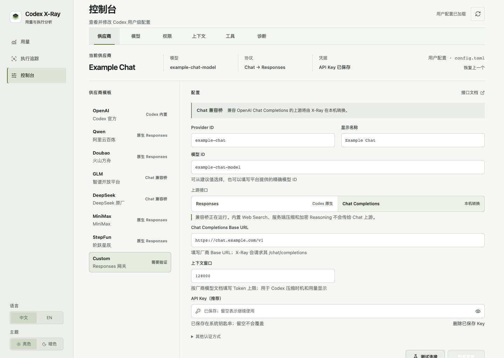
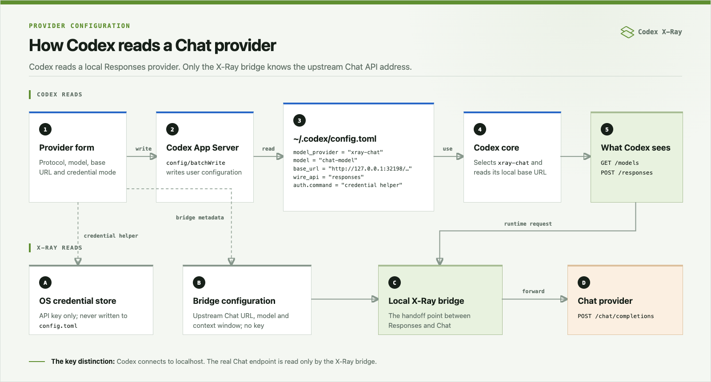
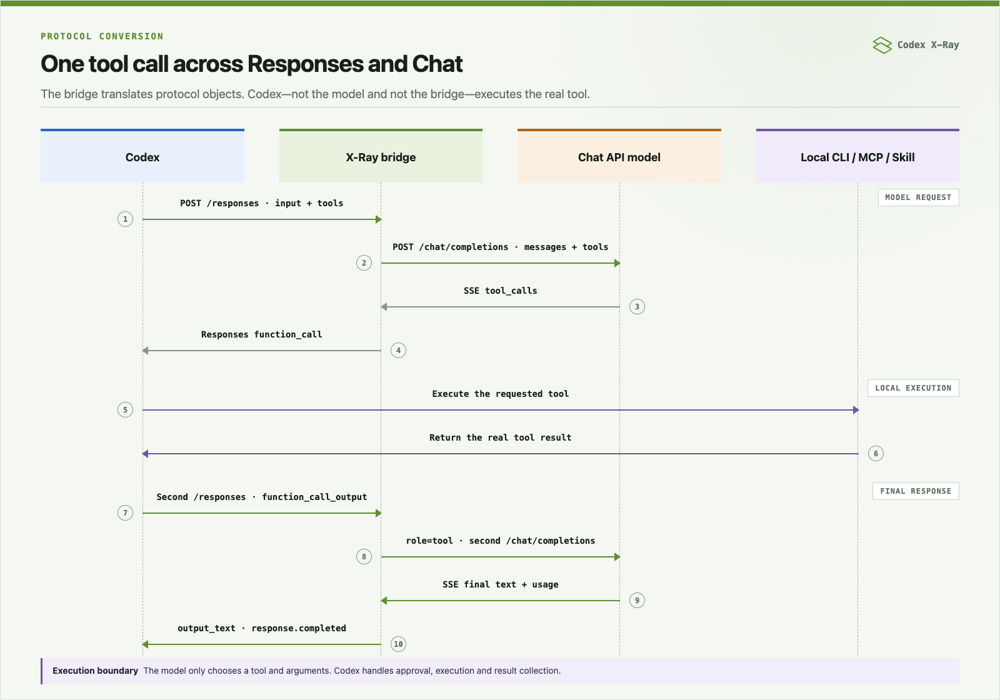

<p align="center">
  
</p>

<h1 align="center">Codex X-Ray</h1>

<p align="center">
  看清 Codex 的用量、成本、上下文与每一步执行。
</p>

<p align="center">
  <a href="README.md">English</a> · <strong>简体中文</strong>
</p>

<p align="center">
  <a href="https://github.com/lakernote/codex-xray/actions/workflows/ci.yml"></a>
  <a href="https://github.com/lakernote/codex-xray/releases"></a>
  <a href="LICENSE"></a>
</p>

Codex X-Ray 是 Codex 的用量与执行分析工具。它展示额度和 Token，按项目、对话和 Turn 统计成本，并还原 LLM 与工具调用的执行 Timeline。

> [!IMPORTANT]
> Codex X-Ray 是非官方开源项目，与 OpenAI 无隶属或背书关系。

## 下载

预览版安装包发布在 [GitHub Releases](https://github.com/lakernote/codex-xray/releases)，根据文件名后缀选择：

| 系统 | 安装包 |
| --- | --- |
| macOS · Apple 芯片 | `_aarch64.dmg` |
| macOS · Intel | `_x64.dmg` |
| Windows · 64 位 | `_x64-setup.exe` |
| Ubuntu / Debian · 64 位 | `_amd64.deb` |
| Fedora / RHEL · 64 位 | `.x86_64.rpm` |

当前预览版尚未使用可信发布者证书签名或公证，首次安装时操作系统可能显示“未知开发者”警告。使用前需要已经安装并登录 Codex。“Source code”压缩包是源码快照，不是安装包。

支持升级的稳定版每天最多检查一次。发现新的稳定版后，可以忽略，也可以让 Codex X-Ray 在应用内完成下载、签名校验、安装和重启。当前 Linux DEB/RPM 安装包仍需手动升级。

## 界面

### 用量概览

官方额度与本地 Session 用量分开呈现，同时展示输入、缓存、输出、年度活动和 API 等价成本。

[](docs/assets/usage-overview.zh-CN.png)

### 模型接入

接入原生 Responses 或 Chat Completions 模型服务，保存多套方案并快速切换。API Key 统一保存在 X-Ray 的用户专属凭据目录。

[](docs/assets/provider-console.zh-CN.png)

### Chat 本机代理

通过 X-Ray 本机兼容桥连接 OpenAI Chat Completions 兼容接口，Codex 侧仍然使用 Responses 协议。

[](docs/assets/chat-bridge-console.zh-CN.png)

### 项目、对话与回合账本

按原始工作目录组织项目，继续下钻到对话和 Turn，核对 Token 与成本去向。

[](docs/assets/project-usage.zh-CN.png)

### 真实执行 Timeline

按 Session 中的顺序解释本地准备、用户输入、LLM 返回、工具请求、Codex 执行、结果写回、Token 结算和回合结束。

[](docs/assets/execution-trace.zh-CN.png)

以上截图全部由虚构项目和模拟 Session 数据生成，不包含真实用户路径、对话、账号或密钥。

## 核心功能

### 用量与成本

展示官方额度和重置时间，并按日、月、模型、项目、对话和 Turn 统计本地 Token 与 API 等价成本。模型单价支持按生效日期自定义。

### 执行追踪

按项目、对话和 Turn 浏览 Session，还原从用户输入、LLM 返回，到 CLI/MCP/Skill 调用、工具结果、Token 结算和回合结束的完整过程。上下文剖析会展示首次、峰值和末次模型输入，压缩边界与估算减少量，本地准备记录和明确的 Memory 使用证据；不会把上下文压缩误算成长期 Memory。

“原始记录”无需先分析即可逐行核对 Session JSONL，同时可查看 X-Ray 自己的 App Server 消息，以及请求经过 Chat 兼容桥时完整的 Responses → Chat → Responses 流程。原生 Provider 的 HTTP 流量由 Codex 直接发送给上游，因此不会伪装成已抓取流量。

### 模型接入与 Codex 配置

保存多套模型接入方案，每套独立记录模型、接口、协议和凭据，并可一键切换。原生 Responses 服务由 Codex 直连；OpenAI Chat 兼容服务通过本机兼容桥接入。常用 Codex 设置也可在 GUI 中修改，启用方案时会保留可恢复的上一状态。

### 桌面工具

支持中英文、亮暗主题、系统托盘、稳定版应用内签名升级和版本检测，并可快速打开 Codex 配置、Session、Skills、Plugins 与 X-Ray SQLite 索引目录。

## Chat 模型服务如何接入 Codex

Codex 不会读取厂商的 Chat Completions 地址。它从 `~/.codex/config.toml` 读取一个普通的自定义接入配置；其中 `base_url` 指向 X-Ray 本机兼容桥，`wire_api` 仍然是 `responses`。

[](docs/assets/provider-flow.png)

API Key 保存在仅当前用户可读的 X-Ray 凭据目录，不把明文写入 `config.toml`。Codex 需要 Bearer Token 时，通过 Provider 官方支持的 `auth.command` 调用 X-Ray 凭据助手。

### 一轮工具调用如何执行

[](docs/assets/chat-bridge-flow.png)

模型只决定调用哪个工具以及参数。Codex 负责审批、执行、收集结果并发起下一次模型调用。兼容桥不会执行工具，只负责转换两种协议的请求字段和流式事件。

Chat 兼容桥目前会转换系统与对话消息、流式文本、函数工具、并行工具调用和 Token 用量。Codex 内置 Web Search、服务端压缩与加密 Reasoning 不会发送给 Chat 上游。

## 数据如何流动

```text
Codex App Server ──账户、额度、对话目录、配置──┐
                                                ├─ Rust 本地分析 ─ SQLite 索引 ─ React 界面
$CODEX_HOME/sessions ──只读 JSONL 事件─────────┘
```

- 官方账户值保持原始口径；本地推导和成本估算会明确标注。
- 原始 Codex Session、数据库和任务内容始终只读。
- 对话只在用户选择后分析；打开目录不会自动解析全部历史。
- 索引存放在 Codex X-Ray 自己的应用数据目录，并使用 SQLite WAL 增量更新。

## 隐私与安全

- 不读取 `auth.json`，不上传本地分析数据。原生 Responses Provider 由 Codex 直连；只有用户在控制台明确选择的 Chat Completions Provider 会经过 X-Ray 本机兼容桥。
- 执行详情会按需从原始 Session 显示用户消息、助手消息和可读摘要；这些正文不写入 SQLite 索引。
- SQLite 只保存用量、结构化阶段、来源行号，以及限长且脱敏的命令、参数和结果元数据；不保存完整工具输出、完整补丁或读取到的文件内容。
- API Key 统一保存到 `~/.codex/codex-xray/credentials/` 下的用户专属凭据文件。Codex 通过官方命令式认证按需读取；Key 不写入 `config.toml`、SQLite、日志或进程参数。本机 Chat 桥只转发当前接入配置的 Key，并忽略无关的入站认证信息。仍可选择环境变量认证。
- 配置修改必须先查看差异并再次确认，同时保留可恢复的上一状态。

更完整的字段来源、计算公式和边界见[中文数据说明](docs/data-sources.zh-CN.md)。安全问题请阅读 [SECURITY.md](SECURITY.md)。

## 从源码运行

开发环境需要：

- Node.js 22（最低 18）
- Rust stable
- 已安装并登录的 Codex

```bash
git clone https://github.com/lakernote/codex-xray.git
cd codex-xray
npm ci
npm run tauri dev
```

构建与验证：

```bash
npm run version:check
npm run check
npm run build
npm run test:rust
npm run tauri build
```

在 macOS 上，npm 包装脚本会把开发与本地发布 Bundle 写入 `src-tauri/target.noindex`，避免构建副本出现在 Spotlight、Finder 应用搜索和 Launchpad；`/Applications` 中正式安装的副本仍会正常显示。

如果 `codex` 不在 `PATH`，应用会尝试检测 Codex/ChatGPT App 的内置 CLI；也可以通过 `CODEX_BIN` 指定可执行文件。

## 当前边界

- API 等价成本用于比较 Token 价值，不是 ChatGPT/Codex 订阅账单或实际扣款。
- 独立 App Server 无法保证看到另一个 Codex App 进程的全部瞬时状态；界面会区分官方状态与本地事件推断。
- Codex App Server 与 Session 格式仍可能变化，兼容性以当前安装版本为准。
- Chat 兼容桥转换文本、流式输出、函数工具、工具结果和 Token 用量；原生 Web Search、加密 Reasoning、服务端压缩等 Responses 专属能力不会被转换。
- 使用 Chat 接入时需要保持 Codex X-Ray 运行；关闭 Codex X-Ray 会停止本地兼容桥。
- 当前主要在 macOS 上验证；发布流程覆盖 Windows、Linux 和 macOS。

## License

[MIT](LICENSE)
